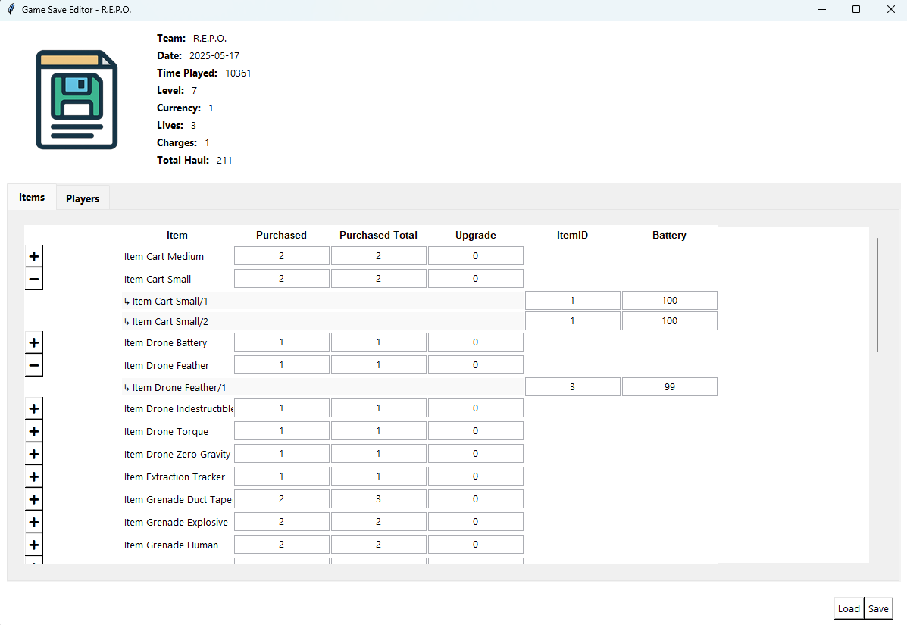
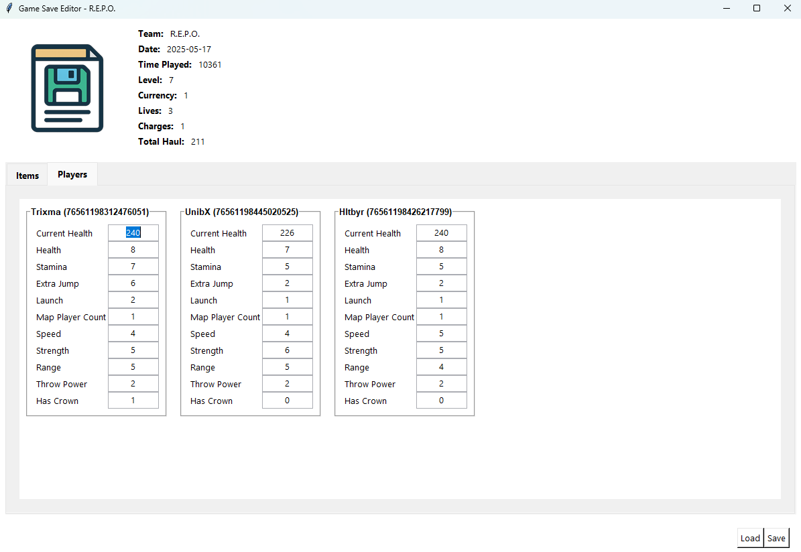

# 🧠 R.E.P.O. Save Editor

<div align="center">
  
</div>

A minimalist and user-friendly GUI tool to decrypt, edit, and re-encrypt save files from the game **R.E.P.O.**  
Edit inventory, item instances, and player stats visually.

---

## 🔍 Features

- 📦 View and edit item inventory, upgrades, and instances
- 👥 Edit player stats side-by-side

---

## 📸 Screenshots

### 🎮 Inventory Editor


### 🧍 Player Editor


---

## 🛠️ How to Use

1. Place your decrypted `.es3` JSON or encrypted save file in the same folder.
2. Run:
   ```bash
   python game_save_editor.py
3. Edit values.
4. Press Ctrl+S to save or Ctrl+Q to quit.

### 🔐 Password
The encryption key is hardcoded:
```python
"Why would you want to cheat?... :o It's no fun. :') :'D"
```

### 📦 Dependencies
- pycryptodome for AES:
```bash
pip install pycryptodome
```

## 💬 License
MIT – Do what you want. Ruin the fun responsibly 😂